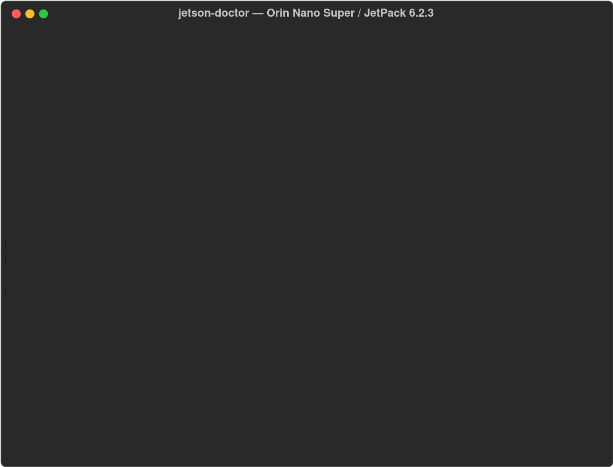

# 🩺 jetson-doctor

[](https://github.com/abs1903/jetson-doctor/actions/workflows/ci.yml)
[](LICENSE)

**One-shot health check for NVIDIA Jetson boards** — find the misconfigurations that break AI stacks *before* they waste your evening.

[English](#english) | [中文](#中文)



---

<a name="english"></a>

## Why

Every Jetson newcomer hits the same walls: containers can't see the GPU ("nvidia runtime not found"), compilers get OOM-killed mid-build, the board throttles at 90 °C, Docker images silently fill the rootfs. The answers exist — scattered across forum threads. `jetson-doctor` puts them in **one command with one report**.

## Quick start

```bash
git clone https://github.com/abs1903/jetson-doctor
cd jetson-doctor
./jetson-doctor.sh
```

No dependencies beyond a stock JetPack system. Bash only.

## What it checks

| Check | Why it matters |
|---|---|
| Device + L4T/JetPack version | The #1 compatibility question (which container tag works?) |
| Docker `nvidia` runtime | Without it, every container fails to see the GPU |
| Docker CDI spec | Required for BuildKit GPU builds on newer stacks |
| Swap size & type | zram-only swap ⇒ OOM during PyTorch/LLM builds |
| Power mode | Desktop/quiet modes leave 2-4× performance on the table |
| Thermals | ≥80 °C warn, ≥95 °C fail — throttling ruins benchmarks |
| Rootfs free space | Container images are multi-GB; a full rootfs bricks updates |
| Docker data-root location | Moving it to NVMe saves your eMMC/SD |
| CUDA toolkit visibility | `nvcc` missing from PATH breaks half the build scripts |

Example output (real run on an Orin Nano Super, JetPack 6.2.3):

```text
===============================================
 jetson-doctor report  |  2026-09-26 21:02:23
 NVIDIA Jetson Orin Nano Engineering Reference Developer Kit Super
 L4T 36.5.0 (JetPack 6.2.3)
===============================================
 [PASS] jetpack-version        L4T 36.5.0 (JetPack 6.2.3)
 [PASS] docker-nvidia-runtime  nvidia runtime registered with Docker
 [WARN] swap-size              Swap 3803MB is tight for 7607MB RAM + big builds
        hint: Create NVMe swap: sudo fallocate -l 16G /swapfile ...
 [PASS] power-mode             Power mode: MAXN_SUPER
 [PASS] thermal                Temp 68C
 ...
-----------------------------------------------
 7 passed, 4 warnings, 0 failures
```

Exit codes: `0` all pass, `1` warnings, `2` failures — so you can drop it straight into setup scripts or CI:

```bash
./jetson-doctor.sh || echo "environment needs attention"
./jetson-doctor.sh --json | jq '.findings[] | select(.level=="FAIL")'
```

## Scope & philosophy

- **Read-only.** It never changes your system; hints only.
- **Opinionated thresholds, visible logic.** Plain bash, every check is a function you can read in 30 seconds.
- **Tested on real hardware**, not just in theory: Orin Nano Super / JetPack 6.2.3. Other boards welcome — see below.

## Roadmap

- [ ] `--fix` mode with explicit per-check confirmation
- [ ] GPU-in-container smoke test (opt-in, pulls a small image)
- [ ] `jtop`/tao metrics when available, graceful fallback when not
- [ ] Aggregate community reports into a per-board knowledge base

## Contributing

Issues and PRs welcome — especially **a report from a different board** (Nano, Xavier, Orin NX...) or a **new L4T→JetPack mapping row**. The mapping table lives in one `case` block in `jetson-doctor.sh`.

## License

MIT

---

<a name="中文"></a>

## 为什么做这个

每个 Jetson 新手都会撞同一批墙：容器看不到 GPU（"nvidia runtime not found"）、编译到一半被 OOM 杀掉、板子 90°C 降频、Docker 镜像悄悄把 rootfs 塞满。答案都有——但散落在无数论坛帖子里。`jetson-doctor` 把它们变成**一条命令、一份报告**。

## 快速开始

```bash
git clone https://github.com/abs1903/jetson-doctor
cd jetson-doctor
./jetson-doctor.sh
```

原生 JetPack 系统零依赖，纯 Bash。

## 检查项

| 检查项 | 为什么重要 |
|---|---|
| 设备型号 + L4T/JetPack 版本 | 第 1 号兼容性问题（该用哪个容器 tag？） |
| Docker `nvidia` runtime | 没有它，所有容器都看不到 GPU |
| Docker CDI 规格 | 新版 BuildKit 构建 GPU 镜像必需 |
| Swap 大小与类型 | 只有 zram ⇒ 编译 PyTorch/LLM 时必 OOM |
| 功耗模式 | 静音/桌面模式白白损失 2-4 倍性能 |
| 温度 | ≥80°C 警告，≥95°C 失败——降频毁掉一切基准测试 |
| 根文件系统剩余空间 | 容器镜像动辄几 GB，rootfs 满了会变砖 |
| Docker data-root 位置 | 挪到 NVMe，保住你的 eMMC/SD |
| CUDA 工具链可见性 | `nvcc` 不在 PATH，一半的构建脚本会挂 |

示例输出（Orin Nano Super / JetPack 6.2.3 真机实测）见上方英文版。

退出码：`0` 全过，`1` 有警告，`2` 有失败——可以直接接进部署脚本或 CI。

## 理念

- **只读**。绝不改动你的系统，只给修复建议。
- **逻辑可见**。纯 Bash，每个检查就是一个函数，30 秒能读完。
- **真机测试**，不是纸上谈兵：Orin Nano Super / JetPack 6.2.3 实测通过。其他板子的测试报告非常欢迎。

## 路线图

- [ ] `--fix` 模式（逐项确认后才动手）
- [ ] 容器内 GPU 冒烟测试（可选，拉取小镜像）
- [ ] 有 `jtop` 时读取更丰富的指标，没有则优雅降级
- [ ] 汇总社区报告，形成按板型的经验知识库

## 参与贡献

欢迎 Issue 和 PR——尤其是**来自其他板型**（Nano、Xavier、Orin NX……）的运行报告，或**新增一行 L4T→JetPack 映射**。映射表就是 `jetson-doctor.sh` 里的一小段 `case`。

## 许可

MIT
